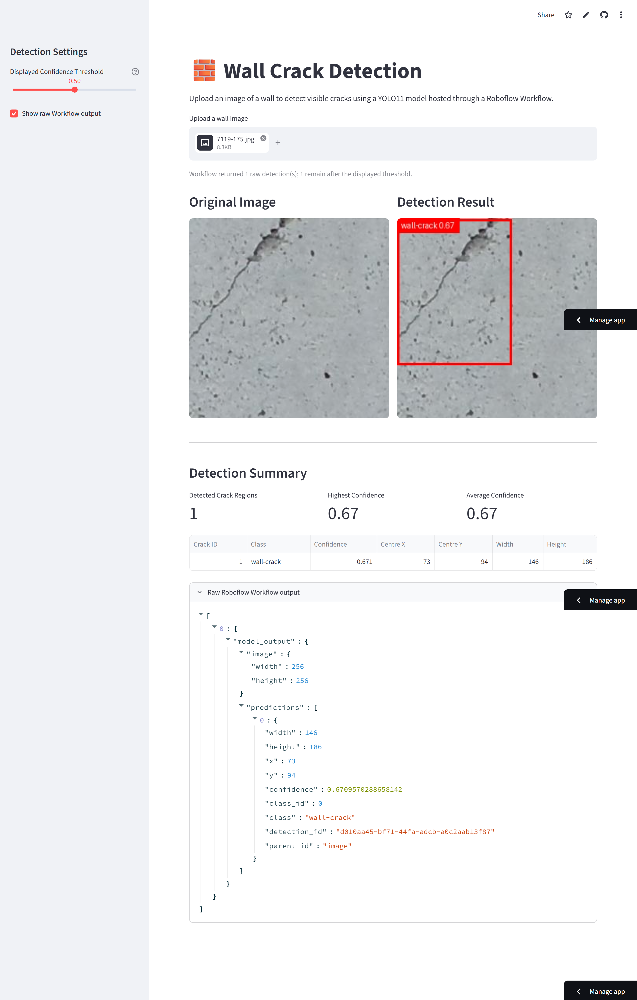

# 🧱 Wall Crack Detection using Roboflow Workflows and Streamlit

A lightweight web application for detecting wall cracks using a **YOLO11 object detection model** trained with **Roboflow** and deployed through a **Roboflow Workflow**.

Instead of hosting the trained model locally, this application sends uploaded images to a Roboflow Workflow running in the cloud. The workflow performs inference using the trained YOLO11 model and returns the detection results, which are then visualized in a user-friendly Streamlit interface.

---

## 🌐 Live Demo

**Streamlit Cloud:** https://wall-crack-roboflow-workflow.streamlit.app/

---

## Features

- 🧱 Detect wall cracks from uploaded images
- ☁️ Cloud inference using Roboflow Workflows
- 📦 No local deep learning model required
- 🎯 Adjustable confidence threshold for visualization
- 🖼️ Side-by-side original and annotated images
- 📊 Detection summary with confidence statistics
- 🔒 Secure API key management using Streamlit Secrets
- 🚀 Easy deployment on Streamlit Community Cloud

---

# System Architecture

```
             Upload Image
                   │
                   ▼
        Streamlit Web Application
                   │
                   ▼
      Roboflow Workflow (Cloud)
                   │
                   ▼
      YOLO11 Object Detection Model
                   │
                   ▼
        Detection Predictions (JSON)
                   │
                   ▼
     Draw Bounding Boxes & Statistics
```

---

# Why Roboflow Workflows?

This project uses a **Roboflow Workflow** instead of calling the object detection model directly.

Advantages include:

- Centralized cloud inference
- Easier deployment
- Workflow versioning
- Built-in preprocessing support
- Built-in postprocessing support
- Future support for chaining multiple AI models
- Streamlit application remains unchanged even if the workflow evolves

For example, additional AI blocks such as OCR, image enhancement, segmentation, or classification can be added later without modifying the web application.

---

# Current Workflow

The current workflow is intentionally simple.

```
Image Input
      │
      ▼
YOLO11 Object Detection Model
      │
      ▼
Predictions Output
```

Although only a single detection model is used, the workflow architecture makes future extensions much easier.

---

# Dataset

**Dataset**

Wall Crack Detection

**Task**

Object Detection

**Model**

YOLO11 Nano

**Classes**

| ID | Class |
|----|-------|
| 0 | wall-crack |

---

# Roboflow Dataset Preprocessing

The dataset version used to train the model was generated with the following preprocessing:

- Auto-Orient
- Resize (Stretch to 640 × 640)
- Contrast Stretching

# Roboflow Dataset Preprocessing

The dataset version uses the following preprocessing:

- Auto-Orient
- Resize (Stretch to 640 × 640)
- Contrast Stretching

Because inference is performed inside the Roboflow Workflow, the predictions closely match those obtained from the Roboflow testing interface.

---

# Project Structure

```
Wall-Crack-Roboflow-Workflow/

│
├── app.py
├── requirements.txt
├── README.md
├── .gitignore
│
└── .streamlit/
    └── secrets.toml
└── images/
    ├── interface.png
    ├── 7119-175.jpg
```

---

# Installation

Clone the repository.

```bash
git clone https://github.com/<your_username>/<repository_name>.git
```

Move into the project.

```bash
cd <repository_name>
```

Install the required packages.

```bash
pip install -r requirements.txt
```

---

# Requirements

```
streamlit
inference-sdk
opencv-python-headless
numpy 
pillow 
```

---

# Configure the Roboflow API Key

Create the following file locally.

```
.streamlit/secrets.toml
```

Add your Roboflow API key.

```toml
ROBOFLOW_API_KEY="YOUR_API_KEY"
```

> **Do not commit this file to GitHub.**

When deploying on Streamlit Community Cloud, add the same API key under:

**App Settings → Secrets**

---

# Running the Application

Start the Streamlit application.

```bash
streamlit run app.py
```

---

# Deployment

This project is designed to run on **Streamlit Community Cloud**.

Deployment steps:

1. Push the repository to GitHub.
2. Sign in to Streamlit Community Cloud.
3. Create a new application.
4. Select this repository.
5. Set `app.py` as the main file.
6. Add the Roboflow API key in **Secrets**.
7. Deploy.

---

# Example Workflow

```
Upload Image
      │
      ▼
Temporary Image File
      │
      ▼
Roboflow Workflow API
      │
      ▼
YOLO11 Detection Model
      │
      ▼
Prediction JSON
      │
      ▼
Draw Bounding Boxes
      │
      ▼
Display Results
```

---

# Technologies Used

- Python
- Streamlit
- Roboflow Workflows
- Roboflow Inference SDK
- OpenCV
- Pillow
- NumPy

---

# Security

The Roboflow API key is **never stored in the repository**.

Instead, the application securely reads the API key from Streamlit Secrets.

```python
api_key = st.secrets["ROBOFLOW_API_KEY"]
```

This prevents sensitive credentials from being exposed in the source code or GitHub repository.

---

# Educational Purpose

This repository was developed as part of a machine vision demonstration to illustrate how modern AI applications can be deployed without managing GPU servers or hosting deep learning models locally.

Students can learn how to:

- Train an object detection model using Roboflow
- Build an inference workflow
- Access AI models through cloud APIs
- Develop interactive web applications using Streamlit
- Deploy AI applications on Streamlit Community Cloud
- Secure API keys using Streamlit Secrets

---

# Possible Future Workflow

The current workflow can easily be extended.

```
Image
   │
   ▼
Image Enhancement
   │
   ▼
Wall Crack Detection
   │
   ▼
Non-Maximum Suppression
   │
   ▼
Crack Severity Classification
   │
   ▼
Automatic Report Generation
```

The Streamlit application would not need to change because all processing is handled inside the Roboflow Workflow.

---

# Future Improvements

- Webcam support
- Video crack detection
- Batch image processing
- Download annotated images
- Detection history
- Crack severity estimation
- Crack length measurement
- Crack area estimation
- PDF inspection report generation
- Mobile-friendly interface

---

# Screenshots



---

# License

This project is released under the MIT License.

---

# Acknowledgements

This project was built using the following open-source technologies:

- Roboflow
- Roboflow Workflows
- Roboflow Inference SDK
- Streamlit
- OpenCV
- Pillow
- NumPy

Special thanks to the Roboflow team for providing an excellent platform for dataset management, model training, workflow creation, and cloud-hosted inference.